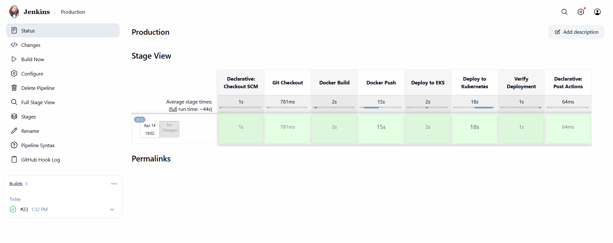
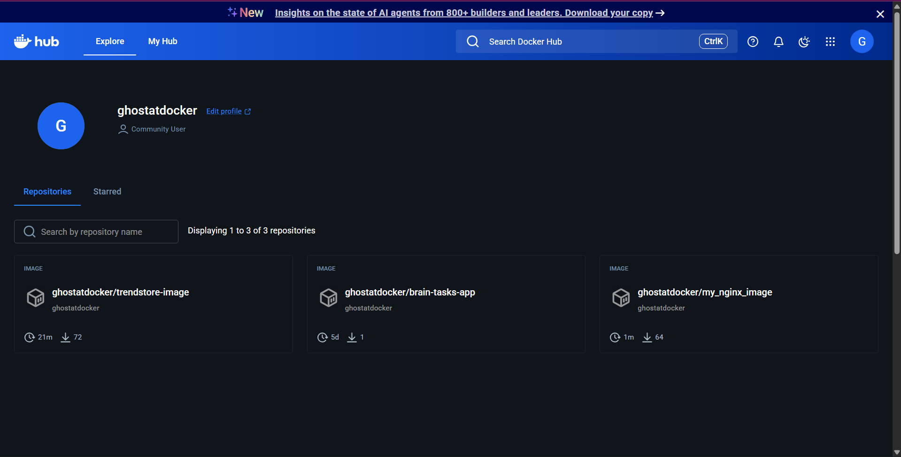
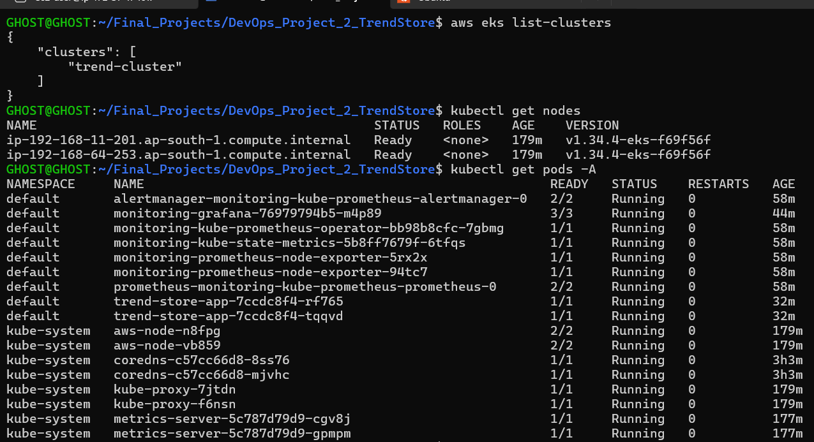
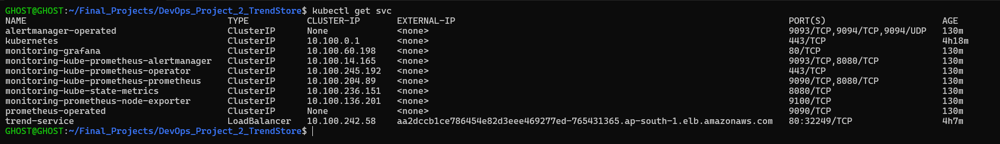
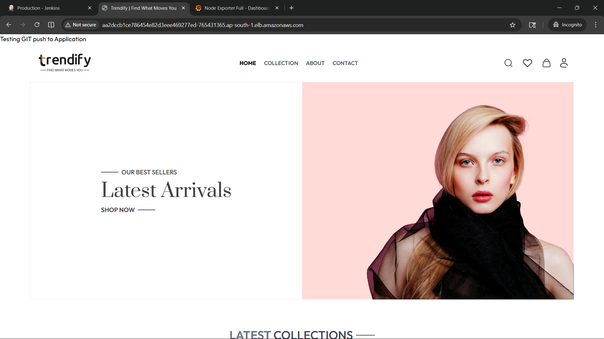
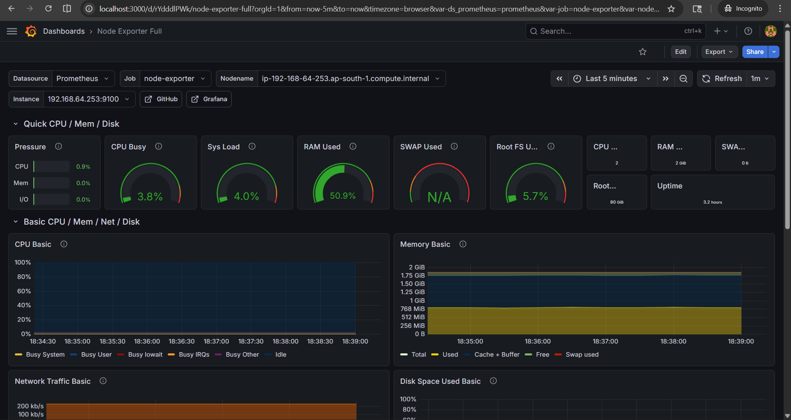

# 🚀 DevOps Project 2 – TrendStore CI/CD Pipeline

## 📌 Project Overview

This project demonstrates a **fully automated CI/CD pipeline on AWS** using Jenkins, Docker, Kubernetes (EKS), Terraform, and Monitoring tools.

The pipeline automates:

* GitHub source control integration
* Docker image build and push
* DockerHub registry storage
* Kubernetes deployment on AWS EKS
* Rolling updates with zero downtime
* Monitoring using Prometheus + Grafana

---

# 🧭 Architecture

```text id="arch-final"
GitHub
   ↓
Jenkins (EC2 via Terraform)
   ↓
Docker Build
   ↓
DockerHub
   ↓
AWS EKS Cluster
   ↓
LoadBalancer (Public Access)
   ↓
Prometheus + Grafana (Monitoring)
```

---

# 🏗️ Infrastructure Setup

Terraform is used to provision:

* EC2 instance for Jenkins
* Docker runtime setup
* Jenkins installation

📁 Path:

```text id="infra-final"
infra/main.tf
```

---

# 📦 Application Details

This project uses a **pre-built React production build**:

```text id="app-final"
Trend/dist
```

✔ No build step required
✔ Direct static deployment

---

# 🐳 Docker Setup

## 📄 Dockerfile

```dockerfile id="docker-final"
FROM nginx:alpine

# Remove default nginx static files
RUN rm -rf /usr/share/nginx/html/*

# Copy dist files
COPY Trend/dist/ /usr/share/nginx/html/

# Expose port
EXPOSE 3000

# Modify nginx to run on port 3000
RUN sed -i 's/listen       80;/listen 3000;/' /etc/nginx/conf.d/default.conf

CMD ["nginx", "-g", "daemon off;"]

```

---

## ▶ Local Run

```bash id="run-final"
docker build -t trendstore-image .
docker run -p 3000:3000 trendstore-image
```

---

# ☸️ Kubernetes Deployment (EKS)

## 📄 Deployment

```yaml id="deployment.yaml"
apiVersion: apps/v1
kind: Deployment
metadata:
  name: trend-store-app
spec:
  replicas: 2
  selector:
    matchLabels:
      app: trendstore
  template:
    metadata:
      labels:
        app: trendstore
    spec:
      containers:
      - name: trendstore
        image: your-dockerhub-username/trendstore-image:latest
        ports:
        - containerPort: 3000
        imagePullPolicy: Always
```

---

## 📄 Service

```yaml id="service.yaml"
apiVersion: v1
kind: Service
metadata:
  name: trend-service
spec:
  type: LoadBalancer
  selector:
    app: trendstore
  ports:
    - port: 80
      targetPort: 3000
```

---

## ▶ Deployment Commands

```bash id="k8s-run-final"
kubectl apply -f k8s/deployment.yaml
kubectl apply -f k8s/service.yaml
```

---

# 🔁 CI/CD Pipeline (Jenkins)

## Pipeline Flow

```text id="flow-final"
GitHub Push
   ↓
Jenkins Trigger (Webhook)
   ↓
Docker Build
   ↓
Docker Push to DockerHub
   ↓
Kubernetes Rolling Deployment
   ↓
Live Application Update
```

---

## 📄 Jenkinsfile

```groovy id="jenkins-final"
pipeline {
    agent any

    environment {
                IMAGE = "ghostatdocker/trendstore-image"
                TAG = "${BUILD_NUMBER}"
        }

    stages {

                stage('Git Checkout') {
                        steps {
                                // Change 'main' to whatever your branch is named (e.g., 'master' or 'develop')
                                git branch: 'main', url: 'https://github.com/Francis-M-D/DevOps_Project_2_TrendStore.git'
                        }
                }

        stage('Docker Build') {
            steps {
                sh 'docker build -t $IMAGE:$TAG .'
            }
        }

        stage('Docker Push') {
            steps {
                // This securely injects your password from Jenkins credentials
                withCredentials([string(credentialsId: 'docker-hub-creds', variable: 'DOCKER_PASS')]) {
                    sh "echo \$DOCKER_PASS | docker login -u ghostatdocker --password-stdin"
                    sh "docker push $IMAGE:$TAG"
                }
            }
        }

        stage('Deploy to EKS') {
            steps {
                sh 'kubectl apply -f k8s/deployment.yaml'
                sh 'kubectl apply -f k8s/service.yaml'
            }
        }

                stage('Deploy to Kubernetes') {
                        steps {
                                sh '''
                                kubectl set image deployment/trend-store-app \
                                trendstore=ghostatdocker/trendstore-image:$TAG

                                kubectl rollout status deployment/trend-store-app
                                '''
                        }
                }
                stage('Verify Deployment') {
            steps {
                sh '''
                kubectl get pods
                kubectl get svc
                '''
            }
        }
        }
        post {
                success {
                        echo "✅ Pipeline executed successfully!"
                }
                failure {
                        echo "❌ Pipeline failed. Check logs."
                }
        }
}
```

---

# 📊 Monitoring Setup (Prometheus + Grafana)

We use **kube-prometheus-stack** for monitoring cluster health.

## Installation

```bash id="mon-final"
helm install monitoring prometheus-community/kube-prometheus-stack
```

## Grafana Access

```bash id="grafana-final"
kubectl port-forward svc/monitoring-grafana 3000:80
```

Login:

```text id="login-final"
Username: admin  
Password: prom-operator (or decoded secret)
```

---

# 📸 Screenshots

## 🔹 Jenkins Pipeline Success



---

## 🔹 Docker Image Push



---

## 🔹 Kubernetes Pods Running



---

## 🔹 Kubernetes Service (LoadBalancer)



---

## 🔹 Live Application UI



---

## 🔹 Grafana Dashboard



---

# 🧹 Environment Cleanup (IMPORTANT)

## Kubernetes cleanup

```bash id="clean-final-1"
kubectl delete -f k8s/service.yaml
kubectl delete -f k8s/deployment.yaml
```

---

## EKS cluster deletion

```bash id="clean-final-2"
eksctl delete cluster --name trend-cluster --region ap-south-1
```

---

## Docker cleanup (Jenkins EC2)

```bash id="clean-final-3"
docker system prune -a -f
```

---

## Terraform cleanup (Jenkins server)

```bash id="clean-final-4"
cd infra
terraform destroy
```

---

# 🧰 Tools Used

* AWS EC2 (Jenkins Server)
* AWS EKS (Kubernetes Cluster)
* Terraform
* Docker
* DockerHub
* Jenkins
* Kubernetes
* Prometheus
* Grafana
* GitHub

---

# 🚀 Key Features

✔ Fully automated CI/CD pipeline
✔ Dockerized frontend application
✔ Kubernetes deployment on AWS EKS
✔ Rolling updates (zero downtime)
✔ Versioned Docker images
✔ Infrastructure as Code (Terraform)
✔ Cluster monitoring with Grafana & Prometheus

---

# 👨‍💻 Author

**Maria Francis D**

```text
DevOps CI/CD Project – TrendStore
```

